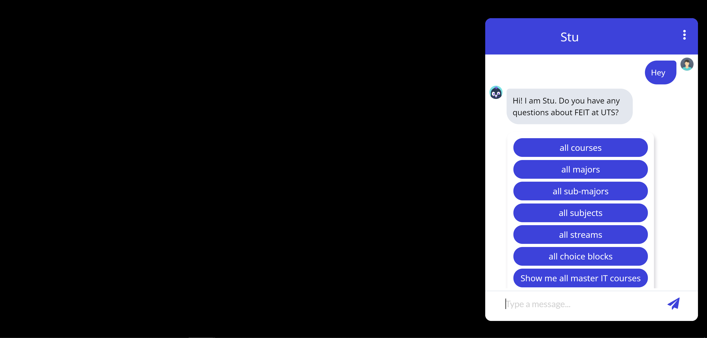

# UTS - 41030 Engineering Capstone - UTS FEIT Chatbot
41030 Engineering Capstone - Spring 2021

Project name: AI Chatbot Development  
Student: Christian Cabato (12915892)  
Major: Data Engineering  

Supervisor: [Wei Liu](https://www.uts.edu.au/staff/wei.liu)  
Co-adivsor: [Xinghao Yang](https://xinghaoyang.github.io/)  
Original chatbot repository: [UTS FEIT Chatbot](https://github.com/XinghaoYang/UTSChatbot)  

Chatbot widget source: [Chatbot Widget](https://github.com/JiteshGaikwad/Chatbot-Widget)  
Conversational AI: [Rasa](https://rasa.com/)  

Video Demonstration: [Chatbot Demonstration](https://youtu.be/7U9V1K7qq-4)  

# Description
The UTS FEIT Chatbot is a chatbot system that responds to user queries regarding courses and underlying sub-structures at the University of Technology Sydney (UTS). My primary responsibility revolves around the improvement of the data management aspects of the current [UTS FEIT Chatbot](https://github.com/XinghaoYang/UTSChatbot) and migrate its Rasa system into the current version of [Rasa X](https://rasa.com/docs/rasa-x/).  

# Rasa Installation  
## Rasa Guide  
For Rasa installation and setup, these resources may assist you.  

 - [Rasa Installation Documentation](https://rasa.com/docs/rasa-x/installation-and-setup/install/local-mode)
 - [Rasa Installation/Setup Video Guide](https://www.youtube.com/watch?v=GwaSJUlB8oA)  

## Software Versions
 - Python 3.8.10  
 - pip 20.0.2  
 - Rasa 2.8.2  
 - Rasa X 0.42.0  
 - spaCy 3.1.1  

# System Instructions
## Webchat  
Please ensure that the Rasa system has been fully set up on your server and underlying packages have been installed.

 - The Chatbot communicates with the Rasa server using the `rest` channel. Ensure that this is enabled or added in the `credentials.yml` file.
 - Open two terminals and run the following commands (from root directory):
    ```
    rasa run actions --cors "*" --debug
    ```
    ```
    rasa run -m models --enable-api --cors "*" --debug
    ```
 - Once the Rasa server is running, interact with the chatbot by running `index.html` file in the browser.  

## Rasa X  
 - To initialise Rasa X for training and validation, open two terminals and run the following commands (from root directory):
    ```
    rasa run actions -vv
    ```
    ```
    rasa x
    ```
---------------------------------------------------------------------------------------------------------
# Datasets  
## Database  
The chatbot is supported by a dataset extracted from [UTS FEIT Chatbot](https://github.com/XinghaoYang/UTSChatbot). This contains information about UTS courses, subjects, majors, sub-majors etc. However, it is important to note that this is currently being used as a sample dataset as it does not compose of all the details about UTS courses as there are no publicly available APIs to be used for complete access. The datasets are stored under `data/csv/` which were trasnformed into a SQLite3 database.  

## NLU
`data/nlu.yml` contains training data of structured information about user messages to determine the intent of the user.  
   ```
   - intent: intent_name
     examples: |
      - sample sentence with [entity](entity_type)

   - intent: list
     examples: |
      - Can you show me the [courses](type) at UTS
      - I would like to know the [subjects](code) at UTS
      - [Majors](code) please
      - Tell me the [subjects](code) at UTS please
      - I would like to hear the [Subjects](code)
      - I would loke to hear the [sub-majors](code), please
      - Can you tell me the [submajors](code)
      - Please tell me the [streams](code) at UTS
   ```

## Stories
`data/stories.yml` contains training data to train the chatbot's conversation and dialogue management that represents the conversation between user and chatbot.  
   ```
   - story: story_name
     steps:
     - intent: intent_name
     - action: action_name

   - story: story_what_can_you_do_02
     steps:
     - intent: greet
     - action: utter_greet
     - intent: what_can_you_do
     - action: utter_what_can_you_do
     - intent: thanks
     - action: utter_thanks
     - intent: goodbye
     - action: utter_goodbye
   ```

## Domain  
`domain.yml` establishes the universe in which the chatbot operates and defines its inputs and outputs.  

# Actions
The chatbot will predict an action that is most relevant to the user message after it has been analysed based on the training components such as stories and NLU. These actions can be regular responses or custom actions that query a database to extract information based on said user query. The following table outlines describes each custom action developed to query the database.   

| Action                 | Description                                                                  |
| ---------------------- |:----------------------------------------------------------------------------:|
| action_atar            | Retrieve ATAR requirements of a course                                       |
| action_children        | Retrieve list of sub-structures under a course or sub-structure              |
| action_credit_points   | Retrieve number of credit points associated to course or sub-structure       |
| action_combined        | Retrieve whether a course is a combined degree                               |
| action_details         | Retrieve details about a course or sub-structure, including its website link |
| action_duration        | Retrieve number of years to complete a course                                |
| action_fees            | Retrieve information about fees                                              |
| action_honours         | Retrieve whether a course is a honours degree                                |
| action_list            | Retrieve list of sub-structures or courses associated to query               |
| action_parent          | Retrieve list of parent courses or sub-structures associated to sub-structure|
| action_prof_prac       | Retrieve whether a course offers a diploma in professional practice          |
| utter_greet            | Responds to user with a regular greeting along with several buttons          |

# Chatbot Snippets
## Home screen  
  
## Chatbot  
  
